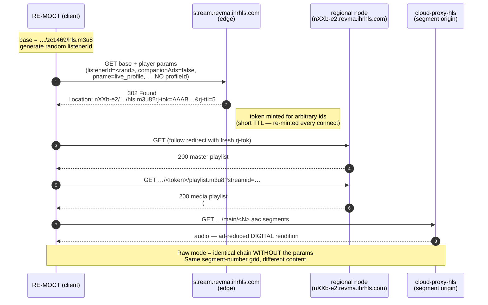

# RE-MOCT — iHeartRadio Stream & Metadata Engineering Debrief - use at your own risk / no affiliation

> **Project:** RE-MOCT (Music On Console Terminal) — a C++20 terminal music player, CD ripper, and internet-radio client
> **Repository:** github.com/RadMageIRL/re-moct
> **Date:** 2026-06-26
> **Author:** (RadMageIRL)
> **Status:** Implemented & verified against live Z100 (WHTZ-FM, iHeart station 1469)

A field report on how RE-MOCT identifies, plays, and labels iHeartRadio stations — including the two distinct streams iHeart serves, the anonymous handshake that unlocks the ad-reduced "web player" rendition, why the now-playing metadata behaves the way it does, and the diagnostic harness that let us prove all of it. Written to be shared: every claim here came from a probe or a captured log, not from assumption.

---

## TL;DR

- iHeart serves **two different audio streams** for the same station: a **raw broadcast simulcast** (the over-the-air signal, full terrestrial ad load) and an **ad-reduced "digital" rendition** (what the web player plays, server-side ad insertion replacing/shortening breaks).
- They share the **same live-edge segment-number clock** but carry **different content** — so "same segment number" does **not** mean "same audio."
- The digital rendition is reachable with an **anonymous, unauthenticated handshake**: append a player query string (with a random `listenerId`, **no account, no `profileId`**) to the base URL; the edge mints a short-lived `rj-tok` via a 302 and serves the digital variant.
- For now-playing, the **in-band manifest metadata is the only source aligned to the audio you actually hear.** iHeart's JSON APIs (`trackHistory`, `currentTrackMeta`) describe the **digital timeline**, which runs **~85 s ahead** of the raw broadcast — useful but wrong for raw audio.
- RE-MOCT reconciles sources with a **debounced state machine** and exposes a **Ctrl+K toggle** between raw and digital modes (sticky, with automatic fallback to raw if the handshake fails).
- Everything above was nailed down with an **opt-in NDJSON deep-analysis log** and a set of standalone probes.

---

## 1. The problem

iHeart HLS streams are notoriously hard to label. Playing the raw `…/zc####/hls.m3u8` URL gives you clean audio but the obvious now-playing sources fight you:

- The in-band ID3 in iHeart segments carries only an HLS timestamp `PRIV` frame — **no song title**.
- iHeart's ICY metadata is nonstandard and breaks conventional parsers.
- The `trackHistory` JSON endpoint **freezes for minutes** on some stations (Z100 went dark for 32+ minutes in one capture) and serves an out-of-order "Pnp" feed.
- The web/app players look perfect, but only because they read iHeart's own synced metadata glued to a stream you're not playing.

The goal: identify what's actually airing on the stream **RE-MOCT** plays, honestly, without pretending a song is on when an ad is.

---

## 2. Diagnostic methodology

The whole investigation followed one rule: **probe first, then fix; never assume.** Three tools made it tractable.

1. **Standalone probes** (`SniffIHeartRadio`, `LatencyProbe`, `StreamHandshakeProbe`) — small WinINet programs that isolate one network behavior at a time, separate from the audio path.
2. **An opt-in deep-analysis log** (`Ctrl+A`) — one NDJSON record per reconciliation tick capturing every metadata source, the audio playback position, the state-machine internals, and the stream mode, side by side.
3. **Cross-checking against the live web player** via browser devtools — every endpoint and stream URL was captured from real traffic before being reproduced.

Several early hypotheses were **killed by data**, which is the point:

- "`currentTrackMeta` is a dead 410 endpoint" → false; it needs `?defaultMetadata=true`.
- "The raw feed sits ~80 s behind the web rendition" → false; they're at the **same** live edge (the gap is metadata + content, not rendition latency).
- "Z100 is a permanent metadata blind" → false; the manifest recovers songs the JSON API misses.

---

## 3. Two streams: raw broadcast vs digital web-player

This was the keystone finding, and it inverts the intuitive assumption that "closer to source = cleaner."

| | **Raw broadcast** (`zc####/hls.m3u8`) | **Digital rendition** (web player) |
|---|---|---|
| What it is | Over-the-air simulcast | Server-side ad-inserted stream |
| Ad load | Full terrestrial (10–18 min/hr, by law) | Reduced / replaced with targeted ads or music |
| Auth | None (public URL) | Anonymous handshake (random `listenerId`) |
| Live-edge segment numbers | shared, identical | shared, identical |
| Audio content at a given segment # | the broadcast (ads during breaks) | the ad-reduced version (music during breaks) |
| JSON metadata (`trackHistory`/`currentTrackMeta`) | describes this? **No** | describes this? **Yes** |
| Song-rotation position | trails | runs ahead (skips ad dead-time) |

### Timing & sync, as measured

- A `LatencyProbe` comparing the two playlists' live-edge segment numbers showed **`+0.0 s` on every sample** — same timeline clock.
- Yet by ear the web player ran **minutes ahead** in *music*. Reconciliation: the segment-number grid is shared, but **SSAI swaps content within it**. The digital stream spends ad-break time on songs, so its musical rotation runs ahead and the two converge only intermittently (we watched them sync on "Post Malone – Circles").
- The JSON metadata API leads the raw audio by a **steady ~85 s**, song after song, in the *same rotation* — because it describes the digital timeline, not the broadcast.

```
 wall-clock ───────────────────────────────────────────────────────────►

 iHeart JSON API    ● Song A ......... ● Song B ......... ● Song C
 (trackHistory /      └─ describes the DIGITAL timeline; leads raw audio ~85 s
  currentTrackMeta)

 DIGITAL rendition  [ Song A ][ Song B ][ Song C ][ Song D ]   ← web player
 (ad-reduced)         same live-edge segment numbers as raw  ────────┐
                                                                      │ +0.0 s
 RAW broadcast      [ Song A ][   long terrestrial ad break  ][ Song B ]
 (RE-MOCT default)    in-band manifest metadata == THIS timeline (audio-aligned)
```

**Consequence:** for the stream RE-MOCT plays by default, only the **in-band manifest** is on the right timeline. The JSON APIs are describing a different broadcast.

---

## 4. The digital-mode handshake

The web player reaches the ad-reduced rendition by hitting the **same base URL** with a player query string. The edge responds with a 302 carrying a freshly minted, short-lived token (`rj-tok`, `rj-ttl=5`), redirects to a regional node, and serves a master → variant playlist where the query params are carried through to the segments.

Crucially, `StreamHandshakeProbe` proved the handshake is **anonymous**: a **random** `listenerId` works, and **`profileId`/`skey` aren't even required** (the "NO-PROF" variant minted a token too). No login, no session-init call.

### Sequence



### Solution code — build the digital URL

The minimal anonymous param set, with a fresh random `listenerId` per connect:

```cpp
// Append the iHeart web-player param set to a raw zc####/hls.m3u8 base URL so the
// edge mints a token and serves the ad-reduced DIGITAL rendition. Minimal anonymous
// set (no profileId/skey — proven sufficient by StreamHandshakeProbe), fresh random
// listenerId per connect.
std::string StreamSource::hlsBuildDigitalUrl(const std::string& base) {
    if (base.find('?') != std::string::npos) return base;     // already parameterized
    std::string id;
    size_t p = base.find("/zc");
    if (p != std::string::npos) {
        p += 3;
        while (p < base.size() && std::isdigit((unsigned char)base[p])) id += base[p++];
    }
    if (id.empty()) return base;

    static bool seeded = false;
    if (!seeded) { std::srand(GetTickCount()); seeded = true; }
    static const char* H = "0123456789abcdef";
    std::string lid; lid.reserve(32);
    for (int i = 0; i < 32; ++i) lid += H[std::rand() & 15];

    return base + "?streamid=" + id +
        "&zip=&aw_0_1st.playerid=iHeartRadioWebPlayer&clientType=web&companionAds=false"
        "&deviceName=web-mobile&dist=iheart&host=webapp.US&listenerId=" + lid +
        "&playedFrom=157&pname=live_profile&stationid=" + id +
        "&terminalId=159&territory=US&us_privacy=1-N-";
}
```

### Solution code — try digital, fall back to raw

The whole feature is graceful-degradation: if any step of the digital attempt fails, fall back to the bare URL **once** so behavior degrades to exactly "today," never worse. The `rj-tok` TTL is a non-issue because the token is never reused — every connect re-runs the 302.

```cpp
// Resolve + initial poll. If a requested DIGITAL attempt fails at any step, fall
// back to the raw broadcast URL once.
bool resolved_ok = hlsResolveMaster() && hlsPollMedia();
if (want_digital && resolved_ok) {
    digital_active_.store(true);
    slog("hlsConnect: DIGITAL rendition active (seq=%d)", connect_seq_.load());
} else if (want_digital && !resolved_ok) {
    slog("hlsConnect: digital attempt FAILED -> falling back to raw broadcast");
    hls_.master_url = master;
    hls_.variant_url.clear();
    hls_.pending.clear();
    hls_.last_seq = 0;
    if (!hlsResolveMaster() || !hlsPollMedia()) {
        slog("hlsConnect: raw fallback also FAILED");
        return false;
    }
    slog("hlsConnect: raw fallback OK (seq=%d)", connect_seq_.load());
} else if (!resolved_ok) {
    slog("hlsConnect: resolve/poll FAILED");
    return false;
} else {
    slog("hlsConnect: raw rendition active (seq=%d)", connect_seq_.load());
}
```

The mode is a sticky config flag (`prefer_digital_stream`), toggled live with **Ctrl+K**, which reconnects the current station so the change takes effect immediately.

---

## 5. Metadata: sources & reconciliation

There are exactly **three** candidate now-playing sources for an iHeart HLS stream. RE-MOCT uses them in a strict confidence order, because they are *not* equally trustworthy and they describe different timelines.

| Source | What it is | Verdict |
|---|---|---|
| **In-band manifest** (`#EXTINF` `title=`/`artist=`/`song_spot=`) | Embedded in the segments you play | **Primary.** Only source aligned to your audio. Freeze-proof when present. Independent of the JSON pipeline. |
| **`trackHistory`** JSON | Recent-songs log | **Fallback.** Freezes; out-of-order; describes the digital timeline. |
| **`currentTrackMeta`** JSON | Live current track (rich: art, album, start/end) | **Enrichment only.** Same pipeline as `trackHistory` (stalls with it); leads audio ~85 s; `204` on breaks. Not used to *identify* songs. |

### Why `currentTrackMeta` is demoted (despite being the "best looking" source)

It was initially recorded as a dead 410 endpoint. It isn't — it needs `?defaultMetadata=true`, then returns a full structured payload (`artist`, `title`, `album`, `imagePath`, `startTime`/`endTime`) or **`204 No Content`** on a break. But the deep log proved it is **redundant with `trackHistory`** (same upstream API — they go blind together) and **on the digital timeline** (so it leads the raw audio). Identifying songs from it would display the *next* song while the current one plays. It survives only as optional album-art/album enrichment when it agrees with the manifest.

```cpp
bool IHeartRadio::pollCurrentTrackMeta(CurrentTrack* out) {
    if (out) *out = CurrentTrack{};
    if (!resolved_ || station_id_ == 0) return false;

    std::string id  = std::to_string(station_id_);
    std::string url = "https://us.api.iheart.com/api/v3/live-meta/stream/" + id +
                      "/currentTrackMeta?defaultMetadata=true";   // <-- the param that flips 410 -> 200
    std::string body; long st = 0;
    bool got = httpGet(url, body, st);
    if (out) out->httpStatus = st;
    if (!got || st != 200) {            // 204 on break, 410 without the param
        logmsg("iheart: currentTrackMeta HTTP " + std::to_string(st));
        return false;
    }
    json j;
    try { j = json::parse(body); } catch (...) { return false; }

    // epoch may be ms (currentTrackMeta) or s — normalise to seconds.
    auto toSec = [](long long v) -> long long {
        return (v > 100000000000LL) ? (v / 1000) : v;
    };
    CurrentTrack c;
    c.artist  = j.value("artist", std::string());
    c.title   = j.value("title",  std::string());
    c.album   = j.value("album",  std::string());
    c.startSec = toSec(j.value("startTime", 0LL));
    c.endSec   = toSec(j.value("endTime",   0LL));
    // … endedSecsAgo / freshness gate omitted for brevity …
    c.ok = !(c.artist.empty() && c.title.empty());
    if (out) *out = c;
    return c.ok;
}
```

### Manifest classification

The manifest is parsed at the **live-edge** `#EXTINF` line. The decisive discriminators are the `song_spot` letter (`M`/`F` = song, `T` = traffic/ad), "Spot Block" markers, and zero-length boundary segments — a plain `title=`/`artist=` check alone is not enough, because ad and boundary lines also carry those attributes.

```cpp
static IHeartMfCls classifyIHeartManifest(const std::string& body,
                                          std::string& artistOut, std::string& titleOut) {
    std::string last;                                     // live-edge EXTINF with a title= attr
    // … scan all #EXTINF lines, keep the last one carrying title=" …

    std::string title  = mfTrim(mfAttr(last, "title=\""));
    std::string artist = mfTrim(mfAttr(last, "artist=\""));

    char spot = 0;                                        // song_spot letter (M/F=song, T=ad)
    // … parse song_spot= …

    bool spotBlock    = title.find("Spot Block")     != std::string::npos;
    bool spotBlockEnd = title.find("Spot Block End") != std::string::npos;
    bool zeroLen      = /* length="00:00:00" */ false;

    // Real song: a genuine artist, not flagged as a spot.
    if (!artist.empty() && spot != 'T' && !spotBlock) {
        artistOut = artist; titleOut = title;
        return IHeartMfCls::Song;
    }
    if (spotBlockEnd || zeroLen) return IHeartMfCls::None;   // boundary / stuck
    if (spot == 'T' || spotBlock) return IHeartMfCls::Ad;    // active ad
    return IHeartMfCls::None;                                // blank/ambiguous -> defer
}
```

### Reconciliation: confidence order + asymmetric debounce

Each tick computes a target from the highest-confidence available source, then commits it through an **asymmetric debounce** state machine (`IHNow`): a song is trusted instantly (1 tick), an ad must persist (3 ticks) **and** be corroborated to avoid painting a "phantom ad" over a real song, and ambiguity floors to an honest `<station> - LIVE` after 2 ticks. The `CUR = 60 s` freshness gate accounts for the player buffer so a just-finished song doesn't flip to LIVE prematurely.

```cpp
const long CUR = 60;
bool thCurrent = !iheart_th_cache_.empty() && iheart_th_ended_ <= CUR;   // playing now

// Confidence-ordered target for this tick.
std::string st = iheart_.stationName();
IHNow tgtKind; std::string tgtDisp;
if (!mfSong.empty())             { tgtKind = IHNow::Song; tgtDisp = mfSong; }   // manifest song — highest confidence
else if (cls == IHeartMfCls::Ad) {                                              // active in-band ad: OVERRIDE the
    tgtKind = IHNow::Ad;                                                        // schedule-based trackHistory song
    tgtDisp = st.empty() ? "Commercial break" : (st + " - Commercial break");
}
else if (thCurrent)              { tgtKind = IHNow::Song; tgtDisp = iheart_th_cache_; }  // trackHistory current song
else                             { tgtKind = IHNow::Live;                                // murk -> honest LIVE
                                   tgtDisp = st.empty() ? "LIVE" : (st + " - LIVE"); }
```

---

## 6. Presentation & the "dual-blind"

The committed display string is what the user sees. Because the manifest is audio-aligned, when it commits a song that is genuinely what's playing. The hard case — Z100's "dual-blind," where `trackHistory` freezes for tens of minutes — turned out **not** to be unsolvable: the manifest goes "RICH" (carries real song metadata) when songs actually air and covered songs the JSON API completely missed. The long `LIVE` stretches mostly coincided with real talk/ad dayparts, where `LIVE` is the honest answer.

The deep log captured the manifest recovering **"Riton – Friday"** while `trackHistory` had been frozen for **32 minutes** — the manifest-primary design doing exactly its job.

---

## 7. Debug logging — the deep-analysis capture

Diagnosing any of this required seeing every source at the same instant, including the **audio playback position** (which the standalone probes can't see). RE-MOCT writes an opt-in NDJSON log (`Ctrl+A`) to `%APPDATA%\RE-MOCT\logs\remoct-deep-analysis-<ts>.log`.

Design points that made it useful:

- **One self-contained record per tick**, emitted **before** the debounce early-returns, so a metadata freeze shows up as data, not a gap.
- **Event-driven + heartbeat** write policy: a record is written when any *semantic* field changes, or every 30 s otherwise. A freeze therefore appears as identical heartbeat records with a **climbing `thEnded` and advancing `mfSeq`** — the freeze signature — rather than silence. Staleness counters are deliberately **excluded** from the change-signature so they don't defeat the heartbeat collapse.
- Each record carries: manifest class + song, `trackHistory` + staleness, `currentTrackMeta` status/fields, audio position, the state-machine internals, and the **stream mode** (`raw`/`digital`) with a per-connect sequence number.

```cpp
DWORD tick = GetTickCount();
std::string s = sigOf(r);   // semantic fields only — excludes thEnded/audioSec/timestamps
bool changed   = first || (s != g_last_sig);
bool heartbeat = first || (tick - g_last_write_tick >= kHeartbeatMs);   // 30s
if (!changed && !heartbeat) return;
// … size-roll at ~2 MB, 5-day retention, then write one JSON line …
```

Sample record (abridged), digital mode:

```json
{"ts":"2026-06-26 10:18:22","audioSec":1342.6,"streamMode":"digital","connectSeq":3,
 "mfCls":"Song","mfSong":"Dua Lipa - Levitating","thEnded":-48,"thCurrent":true,
 "ctmStatus":200,"ctmArtist":"Dua Lipa","ctmTitle":"Levitating","ctmEndedSecsAgo":-48,
 "stState":"Song","stDisp":"Dua Lipa - Levitating","writeReason":"change"}
```

---

## 8. Key findings (all empirically established)

1. iHeart serves **two streams** (raw broadcast vs digital/SSAI) at the **same live-edge clock** but with **different content**.
2. The digital rendition is unlocked by an **anonymous handshake** — random `listenerId`, **no account, no `profileId`**.
3. The **in-band manifest is the only audio-aligned now-playing source** for the raw stream; it's an **independent subsystem** from iHeart's JSON API.
4. `trackHistory` and `currentTrackMeta` are the **same upstream pipeline** — they stall together and both describe the **digital** timeline (~85 s ahead of raw audio).
5. `currentTrackMeta` is alive (`?defaultMetadata=true`), `200`/`204`-honest, and rich — but **redundant and timeline-wrong for identification**; useful only as enrichment.
6. The "Z100 dual-blind" is an **iHeart JSON pipeline stall**, not a total blind — the manifest covers it when songs air.
7. The perceived "100 s lag" is **metadata-runs-ahead (~85 s) plus the player's ~20 s prime buffer**, *not* a rendition latency (segment numbers sync `+0.0 s`).

---

## 9. Limitations & honest caveats

- **Detection on the raw stream is at the ceiling for this approach.** The two real sources (manifest, `trackHistory`) are both used; the third (`currentTrackMeta`) adds nothing for identification. You can't tune detection to produce signal the feed doesn't carry. The one path *past* this ceiling is **audio fingerprinting** (e.g. Chromaprint/AcoustID) on the decoded audio — timeline-perfect and station-agnostic, but a larger build with a database dependency.
- **The handshake is undocumented and can change.** It's mitigated by the always-available **raw fallback** and by logging the digital-vs-fallback outcome, so a future break degrades gracefully and is observable.
- **Digital mode imports iHeart's personalization layer** — targeted ads and a tracking beacon — and the `listenerId`, though random per session, is a tracking handle. It is therefore **opt-in, default-off, and per-keypress**, never silent.
- Findings are characterized primarily on **Z100 (1469)**; manifest "richness" is **daypart-dependent** and varies by station.

---

## Appendix — probe tools

| Tool | Purpose |
|---|---|
| `SniffIHeartRadio` | Endpoint discovery + manifest EXTINF inspection (`-M`/`-P`/`-S` modes) |
| `LatencyProbe` | Diffs raw vs digital live-edge segment numbers → proved `+0.0 s` rendition sync |
| `StreamHandshakeProbe` | Tested the handshake with throwaway credentials → proved anonymous, no `profileId` needed |
| Deep-analysis log (`Ctrl+A`) | Per-tick NDJSON of all sources + audio position + stream mode |

---

*Built and verified on MSYS2 UCRT64 / GCC 15.2 / ncursesw. Shared in the spirit of saving the next person the reverse-engineering. Corrections welcome via the repo.*
