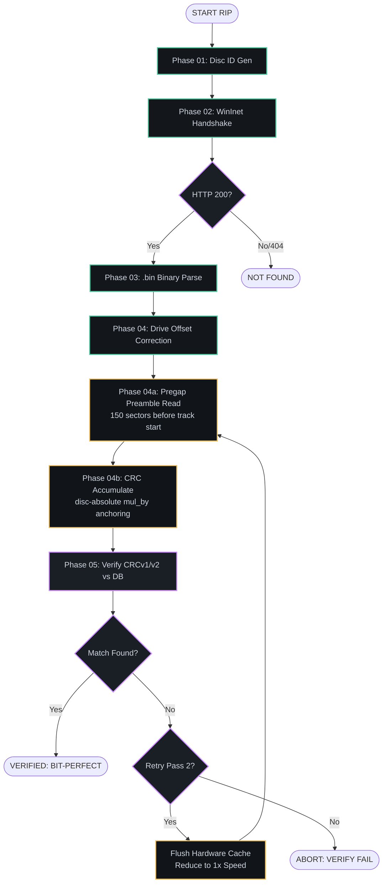

# RE-MOCT - Music On Console Terminal

> A homage to MOC - keyboard-driven terminal CD player and ripper for Windows.

📖 **[Documentation & Feature Guide](https://radmageirl.github.io/re-moct/)**

---

**Status:** Work in progress - no release yet. Polishing the Windows client, Linux port planned.

Built with C++20 · ncurses · miniaudio · TagLib · AccurateRip

📧 tattersgaming@gmail.com

Example TUI:

  

  

  

## AccurateRip Pipeline

## Acknowledgements

- **[Leo Bogert](https://github.com/leo-bogert/accuraterip-checksum)** - authoritative AccurateRip CRCv2 reference implementation (`accuraterip-checksum.c`), which confirmed the correct formula including disc-absolute pregap anchoring
- **[AccurateRip](https://www.accuraterip.com)** (Spoon) - the AccurateRip verification database, used under non-commercial terms. Drive offset database sourced from [accuraterip.com/driveoffsets.htm](https://www.accuraterip.com/driveoffsets.htm)
- **[MusicBrainz](https://musicbrainz.org)** - open music metadata database, DiscID lookup and text search
- **[whipper](https://github.com/whipper-team/whipper)** & **[CUETools](http://cue.tools/wiki/CUETools)** - reference implementations consulted during AccurateRip research
