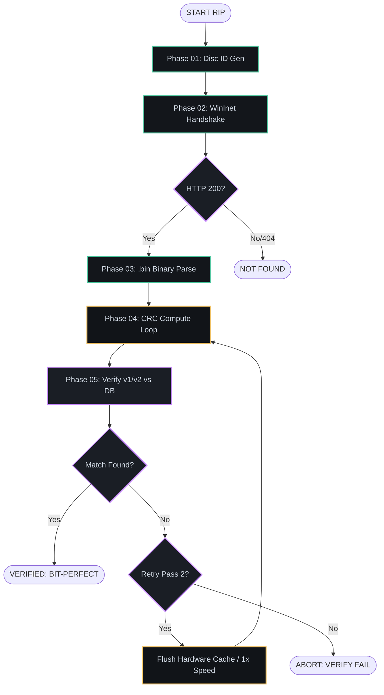

## AccurateRip Pipeline

```mermaid
graph TD
    classDef hardware fill:#13161b,stroke:#4fc8a0,stroke-width:2px,color:#cdd5df;
    classDef handshake fill:#1a1e25,stroke:#c98bff,stroke-width:2px,color:#cdd5df;
    classDef forensic fill:#111418,stroke:#f0c060,stroke-width:2px,color:#cdd5df;

    Start([START RIP]) --> A[Phase 01: Disc ID Gen]
    A --> B[Phase 02: WinInet Handshake]
    B --> C{HTTP 200?}
    
    C -- Yes --> D[Phase 03: .bin Binary Parse]
    C -- No/404 --> F([NOT FOUND])
    
    D --> E[Phase 04: CRC Compute Loop]
    E --> G[Phase 05: Verify v1/v2 vs DB]
    
    G --> H{Match Found?}
    H -- Yes --> I([VERIFIED: BIT-PERFECT])
    H -- No --> J{Retry Pass 2?}
    
    J -- Yes --> K[Flush Hardware Cache / 1x Speed]
    K --> E
    J -- No --> L([ABORT: VERIFY FAIL])

    class A,B,D hardware;
    class C,G,H,J handshake;
    class E,K forensic;
```
